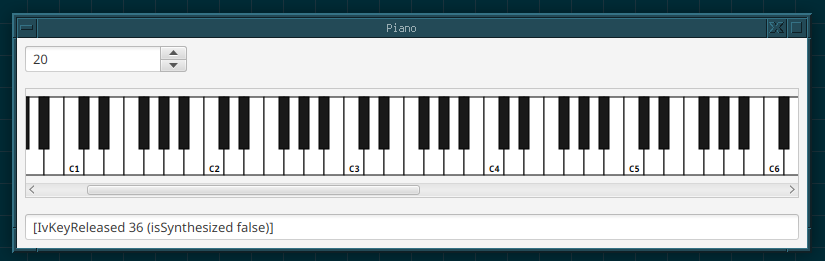

ivoirax
===

| JVM | Platform | Status |
|-----|----------|--------|
| OpenJDK (Temurin) Current | Linux | |
| OpenJDK (Temurin) LTS | Linux | |
| OpenJDK (Temurin) Current | Windows | |
| OpenJDK (Temurin) LTS | Windows | |

## ivoirax

A JavaFX piano component.

## Features

* Simple piano display component.
* Display a configurable number of octaves.
* Capture key press/release events.
* Available in horizontal and vertical forms.
* Written in pure Java 21.
* [OSGi-ready](https://www.osgi.org/).
* [JPMS-ready](https://en.wikipedia.org/wiki/Java_Platform_Module_System).
* ISC license.

## Usage

Add a `IvHorizontalPiano` or `IvVerticalPiano` to your JavaFX layouts. Set a
`IvKeyEventHandlerType` function to receive key events.

## Demo

A [demo application](com.io7m.ivoirax.demo) is included.

